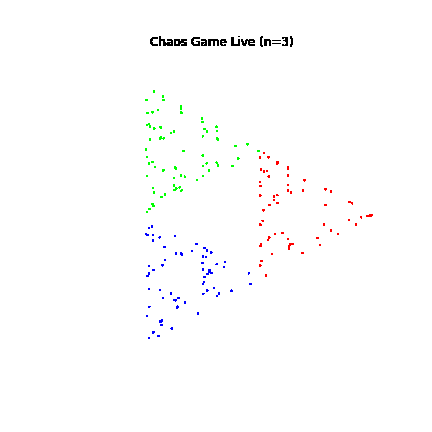

**CHAOS GAME: VISUALIZING FRACTALS THROUGH COMPUTATIONAL SIMULATION**
====
**Project overview:**
-
  This project takes a look at the Chaos Game, a mathematical procedure that generates fractal patterns by iteratively plotting points inside a polygon. It demostrates the intersection of computational physics, geometry, and dynamical systems through code and animation. 

  The Chaos Game's algorithm starts with a regular polygon defined by a number of sides. Beginning from an initial point inside the polygon, the algorithm repeatedly selects one of the polygon's vertices at random and moves the current point closer to that vertex by a fixed ratio. As this process iterates, the points converge to a fractal pattern known as the Sierpinski Gasket (for a triangle) or other fractal attractors for polygons with more sides.

 **Mathematical concept:**
 -
The Chaos Game provides an intuitive way to visualize fractal geometry and iterated function systems (IFS). These are key concepts in computational physics and chaos theory. It reveals how simple random processes governed by geometric constraints can produce complex, self similar structures at multiple scales. 

 1. Polygon vertices: The fixed points acting as attractors. 

 2. Ratio parameter (r): Controls how far the current point moves towards the chosen vertex each iteration. This ratio significantly impact the resulting fractal's shape and density.

 3. Random vertex selection: Introduces stochasticity, key to the fractal formation. 
 
 **Parameters and their effects:**
 -
* *num_sides:*  Number of vertices in the polygon. A triangle (*num_sides = 3*) generates the classic Sierpinski triangle fractal. Increasing sides changes the fractal complexity.

* *r* (ratio): Fractional distance moved towards a randomly selected vertex each iteration (0.5 means halfway). Smaller values produce denser fractals; larger values procude sparser patterns.

* *frames* and *points per frame*: Control animation speed and visual density.
 
 **How to run the code**
 -
1. **requirements:**
  * Python 3.x
  * Libraries: *matplotlib*, *numpy* (optional), *colorsys*

2. **Run animation:**
  * Execute the script in a Jupyter Notebook or any python enviroment supporting *matplotlib.animation*. The code generates a live animated visualization of the chaos game fractal. 
 
 **Example output**
 -

 
 **Why this project matters:**
 -
 This project showcases my passion for computational physics and mathematical modeling by bridging theory and code. More specifically it highlights:
 * An understanding of fractals and chaos theory
 * Skills in python programming and scientific visualization
 * Ability to create meaningful and educational simulations
 * Commitment to exploring interdisciplinary science through computation
